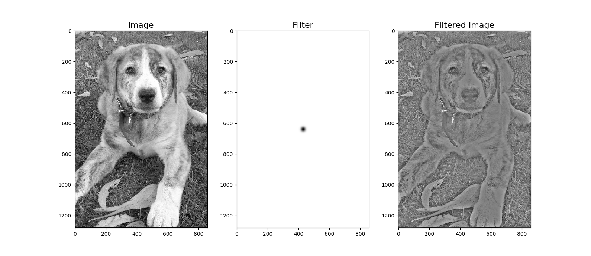
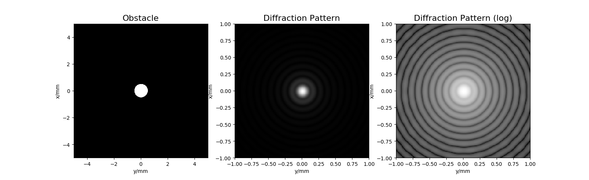
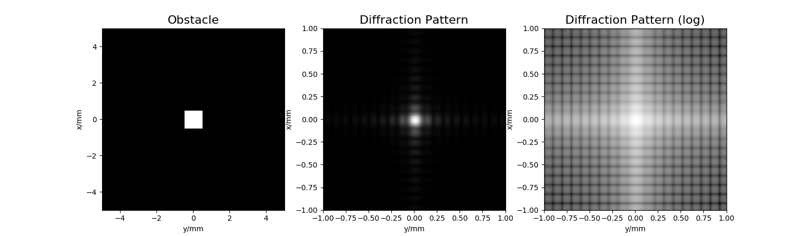

# Photonics UC

Assignments for my photonics course during my Physics M.Sc. in the University of Cantabria.

## Requirements

 - Python 3
 - numpy
 - matplotlib
 
## Usage
 
Run the scripts and follow their instructions.

 - filtering.py: basic Fourier-based image filtering

 

 
 - diffraction.py: plain wave diffraction/propagation using either Fresnel or Fraunhoffer approximation 

 

